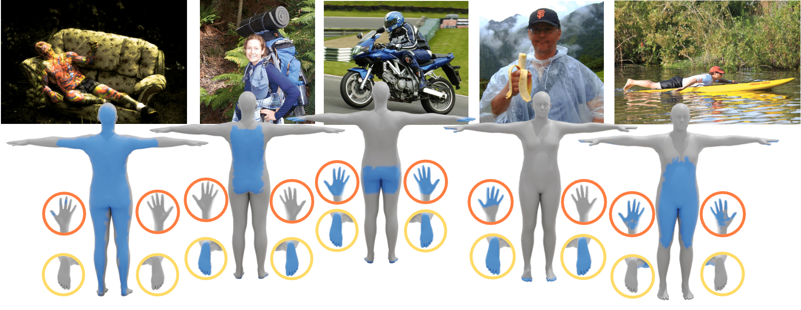

# DECO: Dense Estimation of 3D Human-Scene Contact in the Wild [ICCV 2023 (Oral)]

> Code repository for the paper:  
> [**DECO: Dense Estimation of 3D Human-Scene Contact in the Wild**](https://openaccess.thecvf.com/content/ICCV2023/html/Tripathi_DECO_Dense_Estimation_of_3D_Human-Scene_Contact_In_The_Wild_ICCV_2023_paper.html)  
> [Shashank Tripathi](https://sha2nkt.github.io/), [Agniv Chatterjee](https://ac5113.github.io/), [Jean-Claude Passy](https://is.mpg.de/person/jpassy), [Hongwei Yi](https://xyyhw.top/), [Dimitrios Tzionas](https://ps.is.mpg.de/person/dtzionas), [Michael J. Black](https://ps.is.mpg.de/person/black)<br />
> *IEEE International Conference on Computer Vision (ICCV), 2023*

[](https://arxiv.org/abs/2309.15273)  [](https://deco.is.tue.mpg.de/)     [](https://colab.research.google.com/drive/1fTQdI2AHEKlwYG9yIb2wqicIMhAa067_?usp=sharing)  [](https://huggingface.co/spaces/ac5113/DECO)



[[Project Page](https://deco.is.tue.mpg.de)] [[Paper](https://arxiv.org/abs/2309.15273)] [[Video](https://www.youtube.com/watch?v=o7MLobqAFTQ)] [[Poster](https://www.dropbox.com/scl/fi/kvhpfnkvga2pt19ayko8u/ICCV2023_DECO_Poster_v2.pptx?rlkey=ihbf3fi6u9j0ha9x1gfk2cwd0&dl=0)] [[License](https://deco.is.tue.mpg.de/license.html)] [[Contact](mailto:deco@tue.mpg.de)]

## News :triangular_flag_on_post:

- [2024/01/31] The DAMON contact labels in SMPL-X format have been released. [This](#convert-damon) is the conversion script.
- [2023/10/12] The [huggingface demo](https://huggingface.co/spaces/ac5113/DECO) has been released.
- [2023/10/10] The [colab demo](https://colab.research.google.com/drive/1fTQdI2AHEKlwYG9yIb2wqicIMhAa067_?usp=sharing) has been released. Huggingface demo coming soon...

## Installation and Setup
1. First, clone the repo. Then, we recommend creating a clean [conda](https://docs.conda.io/) environment, activating it and installing torch and torchvision, as follows:
```shell
git clone https://github.com/sha2nkt/deco.git
cd deco
conda create -n deco python=3.9 -y
conda activate deco
pip install torch==1.13.0+cu117 torchvision==0.14.0+cu117 --extra-index-url https://download.pytorch.org/whl/cu117
```
Please adjust the CUDA version as required.

2. Install PyTorch3D from source. Users may also refer to [PyTorch3D-install](https://github.com/facebookresearch/pytorch3d/blob/main/INSTALL.md) for more details.
However, our tests show that installing using ``conda`` sometimes runs into dependency conflicts.
Hence, users may alternatively install Pytorch3D from source following the steps below.
```shellconvert-damon
git clone https://github.com/facebookresearch/pytorch3d.git
cd pytorch3d
pip install .
cd ..
```Converting DAMON contact labels to SMPL-X format (and back)

3. Install the other dependancies and download the required data.
```bash
pip install -r requirements.txt
sh fetch_data.sh
```

4. Please download [SMPL](https://smpl.is.tue.mpg.de/) (version 1.1.0) and [SMPL-X](https://smpl-x.is.tue.mpg.de/) (v1.1) files into the data folder. Please rename the SMPL files to ```SMPL_FEMALE.pkl```, ```SMPL_MALE.pkl``` and ```SMPL_NEUTRAL.pkl```. The directory structure for the ```data``` folder has been elaborated below:

```
├── preprocess
├── smpl
│   ├── SMPL_FEMALE.pkl
│   ├── SMPL_MALE.pkl
│   ├── SMPL_NEUTRAL.pkl
│   ├── smpl_neutral_geodesic_dist.npy
│   ├── smpl_neutral_tpose.ply
│   ├── smplpix_vertex_colors.npy
├── smplx
│   ├── SMPLX_FEMALE.npz
│   ├── SMPLX_FEMALE.pkl
│   ├── SMPLX_MALE.npz
│   ├── SMPLX_MALE.pkl
│   ├── SMPLX_NEUTRAL.npz
│   ├── SMPLX_NEUTRAL.pkl
│   ├── smplx_neutral_tpose.ply
├── weights
│   ├── pose_hrnet_w32_256x192.pthConverting DAMON contact labels to SMPL-X format (and back)
├── J_regressor_extra.npy
├── base_dataset.py
├── mixed_dataset.py
├── smpl_partSegmentation_mapping.pkl
├── smpl_vert_segmentation.json
└── smplx_vert_segmentation.json
```

### Download the DAMON dataset

⚠️ Register account on the [DECO website](https://deco.is.tue.mpg.de/register.php), and then use your username and password to login to the _Downloads_ page.

Follow the instructions on the _Downloads_ page to download the DAMON dataset. The provided metadata in the `npz` files is described as follows: 
- `imgname`: relative path to the image file
- `pose` : SMPL pose parameters inferred from [CLIFF](https://github.com/huawei-noah/noah-research/tree/master/CLIFF)
- `transl` : SMPL root translation inferred from [CLIFF](https://github.com/huawei-noah/noah-research/tree/master/CLIFF)
- `shape` : SMPL shape parameters inferred from [CLIFF](https://github.com/huawei-noah/noah-research/tree/master/CLIFF)
- `cam_k` : camera intrinsic matrix inferred from [CLIFF](https://github.com/huawei-noah/noah-research/tree/master/CLIFF)
- `polygon_2d_contact`: 2D contact annotation from [HOT](https://hot.is.tue.mpg.de/)
- `contact_label`: 3D contact annotations on the SMPL mesh
- `contact_label_smplx`: 3D contact annotation on the SMPL-X mesh
- `scene_seg`: path to the scene segmentation map from [Mask2Former](https://github.com/facebookresearch/Mask2Former)
- `part_seg`: path to the body part segmentation map

The order of values is the same for all the keys. 

<a name="convert-damon"></a>
#### Converting DAMON contact labels to SMPL-X format (and back)

To convert contact labels from SMPL to SMPL-X format and vice-versa, run the following command
```bash
python reformat_contact.py \
    --contact_npz datasets/Release_Datasets/damon/hot_dca_trainval.npz \
    --input_type 'smpl'
```

## Run demo on images
The following command will run DECO on all images in the specified `--img_src`, and save rendering and colored mesh in `--out_dir`. The `--model_path` flag is used to specify the specific checkpoint being used. Additionally, the base mesh color and the color of predicted contact annotation can be specified using the `--mesh_colour` and `--annot_colour` flags respectively. 
```bash
python inference.py \
    --img_src example_images \
    --out_dir demo_out
```

## Training and Evaluation

We release 3 versions of the DECO model:
<ol>
    <li> DECO-HRNet (<em> Best performing model </em>) </li>
    <li> DECO-HRNet w/o context branches </li>
    <li> DECO-Swin </li>
</ol>

All the checkpoints have been downloaded to ```checkpoints```. 
However, please note that versions 2 and 3 have been trained solely on the RICH dataset. <br>
We recommend using the first DECO version.

Please download the actual DAMON dataset from the website and place it in ```datasets/Release_Datasets``` following the instructions given.

### Evaluation
To run evaluation on the DAMON dataset, please run the following command:

```bash
python tester.py --cfg configs/cfg_test.yml
```

### Training
The config provided (```cfg_train.yml```) is set to train and evaluate on all three datasets: DAMON, RICH and PROX. To change this, please change the value of the key ```TRAINING.DATASETS``` and ```VALIDATION.DATASETS``` in the config (please also change ```TRAINING.DATASET_MIX_PDF``` as required). <br>
Also, the best checkpoint is stored by default at ```checkpoints/Other_Checkpoints```.
Please run the following command to start training of the DECO model:

```bash
python train.py --cfg configs/cfg_train.yml
```

### Training on custom datasets

To train on other datasets, please follow these steps:
1. Please create an npz of the dataset, following the structure of the datasets in ```datasets/Release_Datasets``` with the corresponding keys and values.
2. Please create scene segmentation maps, if not available. We have used [Mask2Former](https://github.com/facebookresearch/Mask2Former) in our work.
3. For creating the part segmentation maps, this [sample script](https://github.com/sha2nkt/deco/blob/main/utils/get_part_seg_mask.py) can be referred to.
4. Add the dataset name(s) to ```train.py``` ([these lines](https://github.com/sha2nkt/deco/blob/d5233ecfad1f51b71a50a78c0751420067e82c02/train.py#L83)), ```tester.py``` ([these lines](https://github.com/sha2nkt/deco/blob/d5233ecfad1f51b71a50a78c0751420067e82c02/tester.py#L51)) and ```data/mixed_dataset.py``` ([these lines](https://github.com/sha2nkt/deco/blob/d5233ecfad1f51b71a50a78c0751420067e82c02/data/mixed_dataset.py#L17)), according to the body model being used (SMPL/SMPL-X)
5. Add the path(s) to the dataset npz(s) to ```common/constants.py``` ([these lines](https://github.com/sha2nkt/deco/blob/d5233ecfad1f51b71a50a78c0751420067e82c02/common/constants.py#L19)).
6. Finally, change ```TRAINING.DATASETS``` and ```VALIDATION.DATASETS``` in the config file and you're good to go!

## Citing
If you find this code useful for your research, please consider citing the following paper:

```bibtex
@InProceedings{tripathi2023deco,
    author    = {Tripathi, Shashank and Chatterjee, Agniv and Passy, Jean-Claude and Yi, Hongwei and Tzionas, Dimitrios and Black, Michael J.},
    title     = {{DECO}: Dense Estimation of {3D} Human-Scene Contact In The Wild},
    booktitle = {Proceedings of the IEEE/CVF International Conference on Computer Vision (ICCV)},
    month     = {October},
    year      = {2023},
    pages     = {8001-8013}
}
```

### License

See [LICENSE](LICENSE).

### Acknowledgments

We sincerely thank Alpar Cseke for his contributions to DAMON data collection and PHOSA evaluations, Sai K. Dwivedi for facilitating PROX downstream experiments, Xianghui Xie for his generous help with CHORE evaluations, Lea Muller for her help in initiating the contact annotation tool, Chun-Hao P. Huang for RICH discussions and Yixin Chen for details about the HOT paper. We are grateful to Mengqin Xue and Zhenyu Lou for their collaboration in BEHAVE evaluations, Joachim Tesch and Nikos Athanasiou for insightful visualization advice, and Tsvetelina Alexiadis for valuable data collection guidance. Their invaluable contributions enriched this research significantly. We also thank Benjamin Pellkofer for help with the website and IT support. This work was funded by the International Max Planck Research School for Intelligent Systems (IMPRS-IS).

### Contact

For technical questions, please create an issue. For other questions, please contact `deco@tue.mpg.de`.

For commercial licensing, please contact `ps-licensing@tue.mpg.de`.
